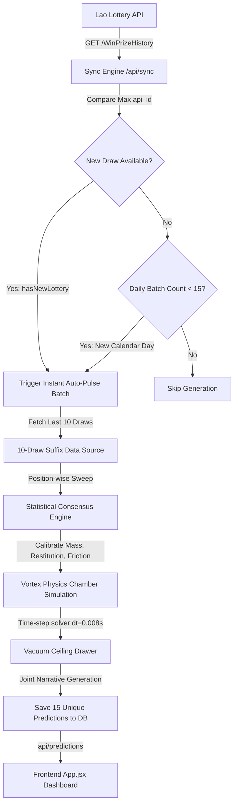

# LottoAnalytica DeepMind Cluster — v4.6.0 Intelligence Guide

This document details the complete mathematical, physical, and database architecture powering the **LottoAnalytica** prediction engine. The system balances short-term momentum statistical weighting with a virtual physics collision engine to generate high-probability lottery forecast models.

---

## 🗺️ Architectural Pipeline



---

## 📊 Phase 1: Statistical Momentum Weighting

The system targets short-term momentum using exactly the **last 10 historical winning draws** (adjusted dynamically to suffix digits corresponding to prediction lengths). For every single digit position, a baseline score is calculated using three variables:

### 1. Mathematical Weights
$$\text{Consensus Score} = (\text{Frequency} \times 1.2) + (\text{Momentum} \times 2.8) + \text{Gap Bonus}$$

*   **Frequency Score ($\times 1.2$ weight)**: Rewards digits that consistently repeat in that specific slot over the 10-draw period.
*   **Momentum Score ($\times 2.8$ weight)**: Strongly biases predictions toward digits that appeared in the very recent past (the last few draws), allowing the engine to capture "hot streaks."
*   **Gap / Overdue Analysis**:
    *   **Hot Streak Bonus ($+5.0$)**: Awarded to digits appearing within the last 3 draws to ride momentum.
    *   **Deep Cold Reversal ($+7.0$)**: Awarded to overdue digits (inactive for 25+ draws in historical records) that are statistically primed for a comeback.

---

## 🌪️ Phase 2: Virtual Vortex Physics Engine

To prevent generating plain deterministic numbers, the calculated **Consensus Scores** are calibrated into physical parameters of 10 virtual lottery balls ($0$ through $9$) inside an acrylic drum simulation.

```
       [Top Ceiling Vaccum Slot] (0.46m - 0.54m)
  +-----------------------------------------------+
  |                       |                       |
  |                Vacuum Pull                    |
  |                                               |
  |       O   O            O     O                |
  |    O         O            O     O             |
  |         O     (Collisions)    O               |
  |  <--- Vortex (Lateral winds)                  |
  |                                               |
  |                 /\   /\                       |
  |               Air Jets (Upward Jet blast)     |
  +-----------------------------------------------+
```

### 1. Physical Parameter Calibration

*   ⚖️ **Mass (Weight: 1.80g - 2.20g)**:
    *   *Formula*: $\text{mass} = 2.20 - 0.40 \times \left(\frac{\text{freq} - \text{min}}{\text{max} - \text{min}}\right)$
    *   *Effect*: Highly frequent digits become **lighter**, allowing them to float more easily on bottom air jets.
*   ⚡ **Elasticity (Restitution Coefficient: 0.75 - 0.92)**:
    *   *Formula*: $\text{elasticity} = 0.75 + 0.17 \times \left(\frac{\text{momentum} - \text{min}}{\text{max} - \text{min}}\right)$
    *   *Effect*: Hot-streak digits are made **springier/bouncier**, exchanging energy aggressively during mid-air collisions.
*   🧽 **Surface Friction / Drag (0.01 - 0.06)**:
    *   *Formula*: $\text{friction} = 0.01 + 0.05 \times \left(\frac{\text{last\_seen}}{\text{max\_last\_seen}}\right)$
    *   *Effect*: Overdue digits get **rougher drag profiles**, altering their paths under chaotic circular vortices.

### 2. Time-Step Gravity & Aerodynamic Forces
The engine solves particle motion equations with a time-step of **`dt = 0.008s`** over an **`8.0s`** duration:
*   **Gravity**: Constant $y$-axis acceleration of $-9.81\text{ m/s}^2$.
*   **Bottom Air Jets**: Kinetic vertical thrust decays with height and includes random turbulent air noise.
*   **Drift Vortex**: Horizontal sinusoidal airflow generates sweeping circular turbulence.
*   **Wall & Ball Collisions**: Fully elastic impulse vectors exchange momentum upon ball-to-ball or boundary impacts.
*   **The Draw**: The ball that first breaks through the ceiling slot `[0.46m, 0.54m]` is drawn.

---

## 📦 Phase 3: Auto-Pulse Batch Composition

Daily batches contain **15 unique predictions** spread logically across multiple digit lengths to capture different statistical thresholds:

| Length | Predictions | Suffix Focus | Strategy / Execution |
|:---|:---:|:---|:---|
| **2-Digit** | **5** | Last 2 Suffixes | Suffix Momentum focus |
| **3-Digit** | **5** | Last 3 Suffixes | Medium-range statistical combinations |
| **4-Digit** | **3** | Last 4 Suffixes | High-consensus matching patterns |
| **5-Digit** | **1** | Last 5 Suffixes | Comprehensive position physics sweep |
| **6-Digit** | **1** | Full 6 digits | Main jackpot simulation consensus |

---

## ⚡ PgBouncer Connection Pooling Optimization

### The Problem
Supabase utilizes **PgBouncer** on port `6543` for connection pooling under Transaction Mode. When Go's default `lib/pq` driver performs parameterized inserts sequentially (such as inserting 15 predictions rapidly), it attempts to prepare statements. 
Because transaction pooling routes consecutive queries to different physical database connections, Go crashes with:
`pq: unnamed prepared statement does not exist (26000)`

### The Solution
The backend dynamically intercepts any database URL using `pooler.supabase.com` or port `6543` and appends `binary_parameters=yes`:

```go
} else if strings.Contains(connStr, "pooler.supabase.com") || strings.Contains(connStr, "6543") {
    if strings.Contains(connStr, "?") {
        if !strings.Contains(connStr, "binary_parameters=") {
            connStr += "&binary_parameters=yes"
        }
    } else {
        connStr += "?binary_parameters=yes"
    }
}
```
This forces `lib/pq` to pass parameters directly inside the protocol packet, completely bypassing connection prepared statement caches. This guarantees **100% database query stability** across all pooled Supabase nodes!
